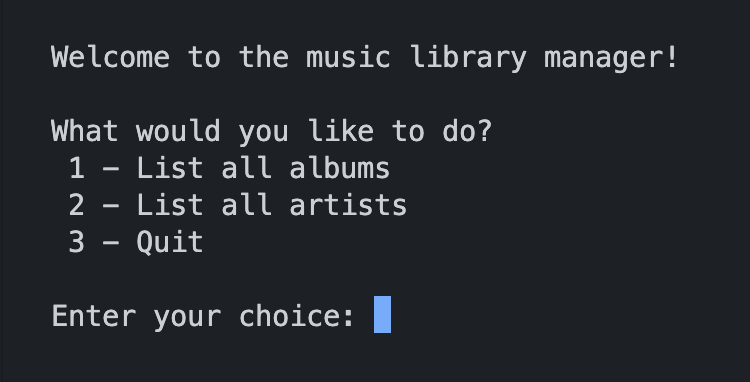
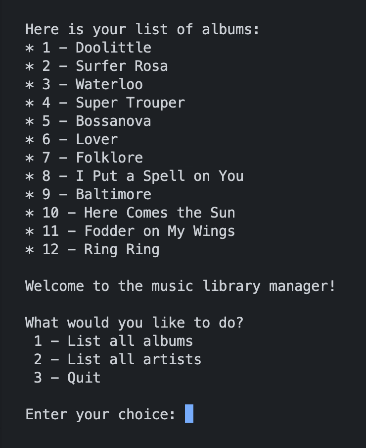
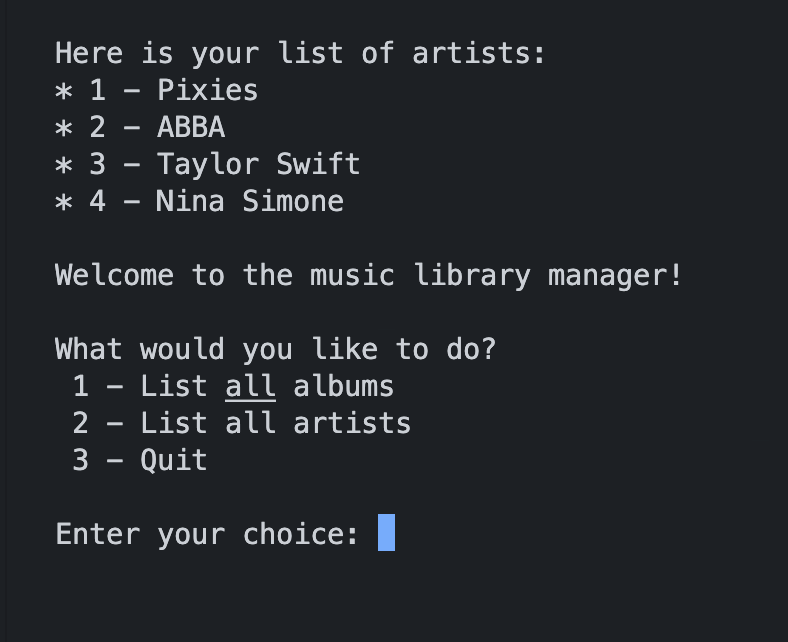

# Music Library Database CLI App

## Description

This is a simple music library database app that allows users to view lists of albums and artists in terminal.
The app is built using Ruby, Sinatra, and PostgreSQL.

## Installation

1. Clone the repository from GitHub.
2. Navigate to the project directory.
3. Install the required gems using `bundle install`.
4. Create the databases for running and testing the app using:
```bash
createdb music_library
createdb music_library_test
```
5. Create the tables with seed data in the databases using the following commands twice:
```bash
psql -h 127.0.0.1 music_library < spec/seeds.sql
psql -h 127.0.0.1 music_library_test < spec/seeds.sql
```
6. Run the app using `ruby app.rb`.

## Usage

The app runs only in CLI. The user can view lists of albums and artists, and quit.

The opening menu looks like this:


The user can view a list of albums:



The user can view a list of artists:



